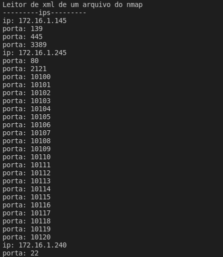

# Script para leitura das saídas do NMAP

Hey pessoal, criei esse script para conseguir armazenar os dados na aplicação Luner, com isso, pego as informações dos computadores, sistema operacional, serviços e produtos que o NMAP identifica e consigo tratar essa informação e fazer o que eu bem desejar, desde exibir essas informações na tela ou rodar scripts baseados na vulnerabilidade que o NMAP trouxe.

## Tela exemplo demonstrando os ips e as portas abertas

